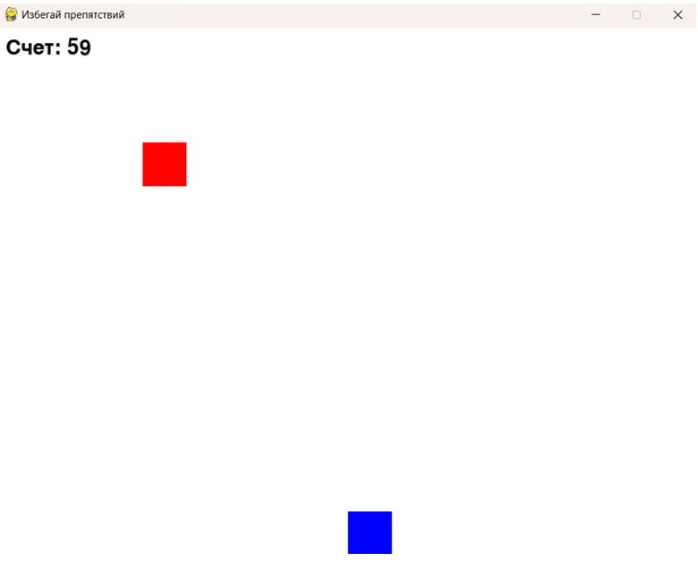

# Избегай Препятствий
## Описание
"Избегай Препятствий" — это захватывающая аркадная игра, в которой игрокам предстоит проверить свою реакцию и ловкость в борьбе с бесконечным потоком препятствий! В этом динамичном процессе вам необходимо управлять своим персонажем, который стремится продвигаться вперед, избегая  преграды, которые появляются на его пути.
## Установка 
У вас должна быть установлена библиотека pygame.
```bash
git clone git@github.com:NeNikita02/-.git
python3 -m pip install pygame
python3 -m venv path/to/venv
source path/to/venv/bin/activate
python3 -m pip install pygame
python3 'play module.py'
```
## Правила 
Основная цель — продержаться как можно дольше, избегая столкновений с препятствиями и зарабатывая очки.

Препятсвия:
Препятствия будут падать вниз рандомно, избегайте их, перемещаясь в сторону.
Очки:
Игрок получает очки за каждую успешную секунду пройденного препятствий.

## Управление 
Игрок управляет персонажем с помощью клавиш управления курсором:
Клавиша влево: перемещение персонажа влево.
Клавиша вправо: перемещение персонажа вправо.



